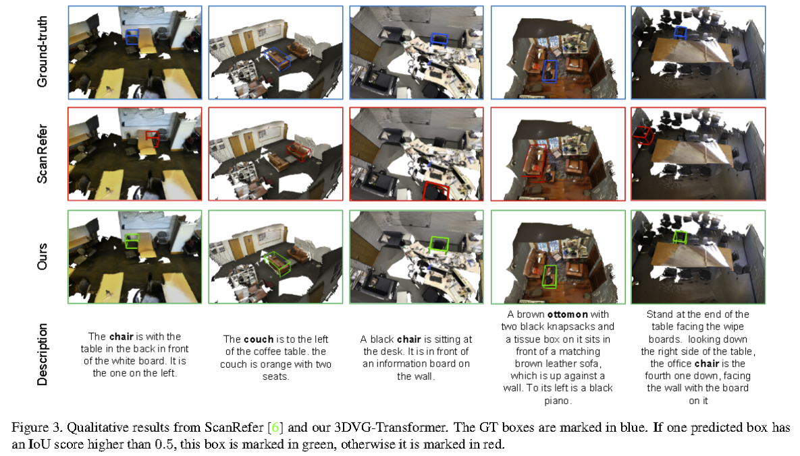

# 3D-XVIGR

This repository is for 3D-XVIGR, a work done at the ADL4CV course at TUM.
It is based on 3-DVG and 3DETR.

## Introduction


We propose 3D-XVIGR (Pronunciation: \textit{3D-Ex-Vigor}. The "X" signifies the use of a \textit{Trans}former, while "VIGR" is an acronym derived from VIsual GRounding.), a novel transformer-based model for the 3D visual grounding task.
The core objective of this task is to accurately localize 3D objects using text descriptions by aligning visual and natural language data.
To achieve this, we formulate our approach by leveraging the aptitude of transformers for 3D point cloud detection and multi-modal matching.
Moreover, we propose a novel decoder layer that inputs object query proposals, point cloud features, and word features to foster a more robust alignment between the textual descriptions and their corresponding 3D visual representations.
Our model performs comparably on the ScanRefer dataset, even without using hand-crafted data augmentation techniques employed by the 3DVG Transformer, our baseline in this work. 
Consequently, our method presents a distinct and more streamlined approach for this task. 
3D-XVIGR also yields promising results in the qualitative analysis, accurately associating textual descriptions with 3D point clouds.
This work, therefore, provides insights into the challenges and opportunities associated with transformer-based solutions for 3D visual grounding. We believe that the findings offer valuable contributions to ongoing discourse and developments in this area, setting the stage for further enhancements to the 3D-XVIGR architecture. 


## Dataset & Setup

### Data preparation

*This codebase is built based on the initial [ScanRefer](https://github.com/daveredrum/ScanRefer) codebase. Please refer to [ScanRefer](https://github.com/daveredrum/ScanRefer) for more data preprocessing details.*

1. Download the ScanRefer dataset and unzip it under `data/`. 
2. Downloadand the preprocessed [GLoVE embeddings (~990MB)](http://kaldir.vc.in.tum.de/glove.p) and put them under `data/`.
3. Download the ScanNetV2 dataset and put (or link) `scans/` under (or to) `data/scannet/scans/` (Please follow the [ScanNet Instructions](data/scannet/README.md) for downloading the ScanNet dataset).

> After this step, there should be folders containing the ScanNet scene data under the `data/scannet/scans/` with names like `scene0000_00`

4. Pre-process ScanNet data. A folder named `scannet_data/` will be generated under `data/scannet/` after running the following command. Roughly 3.8GB free space is needed for this step:

```shell
cd data/scannet/
python batch_load_scannet_data.py
```

> After this step, you can check if the processed scene data is valid by running:
>
> ```shell
> python visualize.py --scene_id scene0000_00
> ```

5. (Optional) Pre-process the **multiview features** from ENet.

- Download:
    Download the ENet [multiview features (~36GB, hdf5 database)](http://kaldir.vc.in.tum.de/enet_feats.hdf5) and put it under `data/scannet/scannet_data/`

- Projection:

   a. Download [the ENet pretrained weights (1.4MB)](http://kaldir.vc.in.tum.de/ScanRefer/scannetv2_enet.pth) and put it under `data/`
   b. Download and decompress [the extracted ScanNet frames (~13GB)](http://kaldir.vc.in.tum.de/3dsis/scannet_train_images.zip).
   c. Change the data paths in `lib/config.py` marked with __TODO__ accordingly.
   d. Project ENet features from ScanNet frames to point clouds (~36GB, hdf5 database).


> ```shell
> python script/project_multiview_features.py --maxpool
> ```

### Setup
The code is tested on Ubuntu 16.04 LTS & 18.04 LTS with PyTorch 1.2.0 CUDA 10.0 installed.

Please refer to the initial [ScanRefer](https://daveredrum.github.io/ScanRefer/) for **pointnet2 packages** for the newer version (>=1.3.0) of PyTorch.

You could use other PointNet++ implementations for the lower version (<=1.2.0) of PyTorch.

```shell
conda install pytorch==1.2.0 torchvision==0.4.0 cudatoolkit=10.0 -c pytorch
```

Install the necessary packages listed out in `requirements.txt`:
```shell
pip install -r requirements.txt
```
After all packages are properly installed, please run the following commands to compile the CUDA modules for the PointNet++ backbone:
```shell
cd lib/pointnet2
python setup.py install
```
__Before moving on to the next step, please don't forget to set the project root path to the `CONF.PATH.BASE` in `lib/config.py`.__

## Usage

### Training
To train the 3DVG-Transformer model with multiview features:
```shell
python scripts/ScanRefer_train.py --use_multiview --use_normal --batch_size 8 --epoch 200 --lr 5e-4 --coslr --tag 3d-xvigr --proposal_generator "3detr" --enc_type masked
```
settings:
XYZ: --use_normal
XYZ+RGB: --use_color --use_normal
XYZ+Multiview: --use_multiview --use_normal

For more training options (like using preprocessed multiview features), please run `scripts/train.py -h`.

### Evaluation
To evaluate the trained models, please find the folder under `outputs/` and run:
```shell
python scripts/ScanRefer_eval.py --folder <folder_name> --reference --use_multiview --no_nms --force --repeat 5 --lang_num_max 1
```
Note that the flags must match the ones set before training. The training information is stored in `outputs/<folder_name>/info.json`

Note that the results generated by ScanRefer_eval.py may be slightly lower than the test results during training. The main reason is that the results of model testing fluctuate, while the maximum value is reported during training, and we do not use a fixed test seed.

### Benchmark Challenge 

**Note that every user is allowed to submit the test set results of each method *only twice*, and the ScanRefer benchmark blocks update the test set results of a method for two weeks after a test set submission.**

After finishing training the model, please download [the benchmark data](http://kaldir.vc.in.tum.de/scanrefer_benchmark_data.zip) and put the unzipped `ScanRefer_filtered_test.json` under `data/`. Then, you can run the following script the generate predictions:

```shell
python benchmark/predict.py --folder <folder_name> --use_color
```

Note that the flags must match the ones set before training. The training information is stored in `outputs/<folder_name>/info.json`. The generated predictions are stored in `outputs/<folder_name>/pred.json`.
For submitting the predictions, please compress the `pred.json` as a .zip or .7z file and follow the [instructions](http://kaldir.vc.in.tum.de/scanrefer_benchmark/documentation) to upload your results.

### Visualization


To predict the localization results predicted by the trained ScanRefer model in a specific scene, please find the corresponding folder under `outputs/` with the current timestamp and run:

```shell
python scripts/visualize.py --folder <folder_name> --scene_id <scene_id> --use_color
```
Note that the flags must match the ones set before training. The training information is stored in `outputs/<folder_name>/info.json`. The output `.ply` files will be stored under `outputs/<folder_name>/vis/<scene_id>/`

In our next version, the heatmap visualization code will be open-sourced in the 3DJCG (CVPR2022, Oral) codebase. 

The generated .ply or .obj files could be visualized in software such as **MeshLab**.
